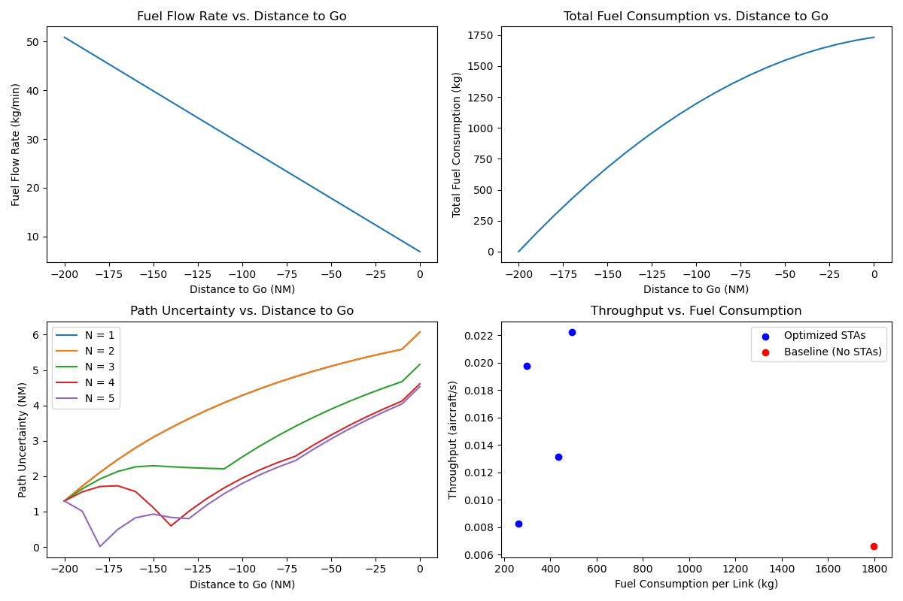

# Aircraft CDA Optimization

This project implements an optimization for Continuous Descent Approach (CDA) trajectories for an A320-like aircraft, minimizing fuel consumption while managing path uncertainty and throughput.


## About the Project

This project is part of the **Applied Optimization** course and is based on the research paper: [Trajectory Specification to Support High-Throughput Continuous Descent Approaches](https://dspace.mit.edu/handle/1721.1/145403).

### Instructor
- **Prof. Sujit PB**

### Team Members
- **Aman Pasi** (Roll No: 22034)
- **Ashish Raj** (Roll No: 22061)
- **Jay Bharambe** (Roll No: 22159)


## Results

The optimization results are stored in the `results/` folder. Key outputs include:

- **`cda_results.npz`**: Contains the numerical results of the optimization, including fuel consumption and trajectory data.
- **`cda_paper_results.png`**: A visual comparison of the optimized trajectory against the baseline from the referenced research paper.

Below is the visualization of the sample result:



These results demonstrate the effectiveness of the optimization in reducing fuel consumption while adhering to the constraints of the CDA procedure.


## How to Run

1. **Clone the repo**:
    ```bash
    git clone https://github.com/jayb71/aircraft_cda_optimization
    cd aircraft_cda_optimization
    ```
2. **Install Dependencies**:
   - Create a virtual environment (Optional):
     ```bash
     python -m venv venv
     source venv/bin/activate  # On Windows: venv\Scripts\activate
     ```
   - Install dependencies:
     ```bash
     pip install -r requirements.txt
     ```

3. **Run the Script**:
   - Navigate to the project root:
     ```bash
     cd aircraft_cda_optimization
     ```
   - Run the main script:
     ```bash
     python scripts/run_optimization.py
     ```

4. **Verify Outputs**:
   - Check the `results/` folder for `cda_results.npz` and `cda_paper_results.png`.
   - Review console output for optimization results and STA details.

